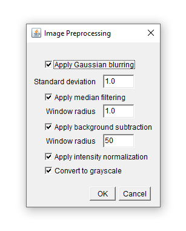
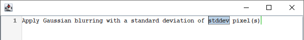

<link href='https://fonts.googleapis.com/css?family=Caveat' rel='stylesheet'>
<!--link rel="stylesheet" href="../../picnic.min.css"-->
<link rel="stylesheet" href="../../github-markdown.css">
<link rel="stylesheet" href="../../projects.css">
<link rel="stylesheet" href="https://cdnjs.cloudflare.com/ajax/libs/highlight.js/11.6.0/styles/intellij-light.min.css">
<script src="https://cdnjs.cloudflare.com/ajax/libs/highlight.js/11.6.0/highlight.min.js"></script>
<script>
function showDialog(id) {
  document.getElementById(id).showModal();
  document.documentElement.style.overflowY = 'hidden';
  return false; // to disable href
}

function hideDialog(id)  {
  document.getElementById(id).close();
  document.documentElement.style.overflowY = '';
  return false; // to disable href
}
</script>
<style>
.markdown-body h1 {
  font-family: 'Caveat';
  font-size: 40;
  background-color: #183d3d;
  color: white;
  padding: 40px;
}

.markdown-body h2 {
  margin-top: 3em;
}

.markdown-body img {
  margin: 50px;
}

/*
table {
  width:100%;
}
table td {
  padding-top: 1em;
  padding-bottom: 1em;
}
*/

dialog {
  max-width: 800px;
  max-height: calc(100vh - 150px);
  overflow-y: auto;
  border-width: 0px;
  box-shadow: 0px 0px 15px;
}

dialog::backdrop {
  background-color: #000000a0;
}

details summary {
  display: block;
}

.content {
  background-color: #f5f5f5;
  margin: 1em;
  margin-right: 0px;
  padding: 10px;
  padding-bottom: 1px;
  font-size: smaller;
  border-radius: 5px;
}

@keyframes details-show {
  from {
    opacity:0;
    transform: var(--details-translate, translateY(-0.5em));
  }
}

details[open] > *:not(summary) {
  animation: details-show 150ms ease-in-out;
}

/*
table th:first-of-type {
  width:20%
}
table th:nth-of-type(2) {
  width:10%
}
table th:nth-of-type(3) {
  width:40%
}
table th:nth-of-type(4) {
  width:30%
}
*/

</style>


# Natural Language Scripting: A first tutorial<br> Image Pre-processing

The Natural Language Scripting (NLS) library provides a framework for replacing graphical user interfaces (GUIs) with a unifiedscripting interface based on natural language.

It provides all the tools necessary for creating domain-specific languages with a natural English syntax for any application:
* Means to define custom lanugage sentences conveniently.
* Define for each language expression what should happen upon parsing it.
* A ready editor to be displayed to the user, equipped with autocompletion based on the defined language.
* Integrated parsing engine and evaluation environment.
* Tools for debugging the language.
* Integrated Error handling


## Basic usage

The Natural Language Scripting framework offers a convenient way to define the sentences your interface should understand, and provides an auto-completion enabled text editor for users to enter their instructions. The following code snippet shows how to create a parser, how to define a pattern for a sentence for it to parse, and how to display the editor:
```java
// Create an instance to our backend
Preprocessing preprocessing = new Preprocessing();

// Create a parser
Parser parser = new Parser();

// Teach the parser a first sentence
parser.defineSentence(

    // The template of the sentence: any variable which is read from the user's input
    // is written in '{' and '}', and specified by a name, a type and optionally a quantifier
    "Apply Gaussian blurring with a standard deviation of {stddev:float} pixel(s).",

    // An evaluator, whose single function is called upon parsing the sentence defined above. It
    // receives a 'ParsedNode', which can be used to evaluate the variables:
    new Evaluator() {
        public Object evaluate(ParsedNode pn) {
            double stdDev = (double)pn.evaluate("stddev");
            preprocessing.gaussianBlur((float)stdDev);
            return null;
        }
    });

// Display an editor, to enter and run user input:
new ACEditor(parser).setVisible(true);
```
In this example we state that we expect a literal "Apply Gaussian blurring with a standard deviation of ", followed by a floating point number, which we name "stddev" for later reference, followed by the literal "pixel(s).".

The evaluator uses a `Preprocessing` object which could be implemented like this, using ImageJ as an underlying image processing library:

<details><summary><b>Preprocessing.java</b></summary>
<pre><code>import ij.IJ;
import ij.ImagePlus;
import ij.process.ImageProcessor;

public class Preprocessing {

	private ImagePlus image;

	public Preprocessing(ImagePlus image) {
		this.image = image;
	}

	public void gaussianBlur(float stdDev) {
		IJ.run(image, "Gaussian Blur...", "sigma=" + stdDev);
	}

	public void medianFilter(int radius) {
		IJ.run(image, "Median...", "radius=" + radius);
	}

	public void subtractBackground(float radius) {
		IJ.run(image, "Subtract Background...", "rolling=50");
	}

	public void convertToGray() {
		if(image.getType() == ImagePlus.COLOR_RGB)
			IJ.run(image, "8-bit", "");
	}

	public void intensityNormalization() {
		convertToGray();
		ImageProcessor ip = image.getProcessor();
		double min = ip.getMin();
		double max = ip.getMax();
		ip = ip.convertToFloat();
		ip.subtract(min);
		ip.multiply(1 / (max - min));
		image.setProcessor(ip);
	}
}
</code></pre>
</details>


This is how it looks like:

<video style="margin: auto; display: block;" width="800" controls>
  <source src="images/2023-09-07-13-11-46.cropped.mp4" type="video/mp4">
</video>


### More details:

* Details how to define variables
* Built-in types apart from `float`
* More detail about custom types
* The same application, as a step-by-step tutorial


## Motivation
Graphical user interfaces can easily become complex and confusing as the number of user input parameters increases. This is particularly true if a workflow needs to be configured, where (i) each step has its own set of parameters, (ii) steps can occur in any order and (iii) steps can be repeated arbitrarily. Consider the configuration of an image pre-processing workflow, which consists of the following algorithms, each having its own set of parameters:
- Gaussian blurring (standard deviation)
- Median filtering (window radius)
- Background subtraction (window radius)
- Conversion to grayscale
- Intensity normalization

A traditional graphical user interface (GUI) could e.g. look like this:



where the user can activate the various algorithms and specify their parameters as necessary. This user interface however does not take into account that different algorithms could occur repeatedly, and it does not allow to change the order.

Using Natural Language Scripting, we want to implement a text-based interface which reads and executes text like:
```bash
Apply Gaussian blurring with a standard deviation of 3 pixel(s).
Subtract the background with a window readius of 30 pixel(s).
Apply Median filtering with a window radius of 1 pixel(s).
Normalize intensities.
Apply Gaussian blurring with a standard deviation of 1 pixel(s).
```


## Custom types
It is possible and also common to define custom types. We could e.g. define a type `filter-size` which consists of a floating point number and a unit (e.g. `pixel(s)`). In `defineSentence` we could then use `filter-size` as type for the standard deviation parameter:

```java
parser.defineType(
    // a name for the type:
    "filter-size",

    // a template string, similar to the one used in 'defineSentence':
    "{stddev:float} pixel(s)",

    // An evaluator, which evaluates this type upon parsing to a custom Java type
    // In this example, it will implicitly evaluate to a Double (because the type
    // of "stddev" is Double).
    new Evaluator() {
        public void evaluate(ParsedNode pn) {
            return pn.evaluate("stddev");
        }
    },

    // Use an optional third parameter to specify that auto-completion should
    // complete the entire type, and insert a placeholder for 'stddev'.
    true);

// Now use the type in a sentence:
parser.defineSentence(
    "Apply Gaussian blurring with a standard deviation of {stddev:filter-size}.",
    new Evaluator() {
        public Object evaluate(ParsedNode pn) {
            double stdDev = (double)pn.evaluate("stddev");
            preprocessing.gaussianBlur((float)stdDev);
            return null;
        }
    });
```
This will work like above, but auto-completion is improved and looks like:




## Finalizing

Now we can define the other sentences like this:

```java
parser.defineSentence(
    "Apply Median filtering with a window of radius {window-size:filter-size}.",
    new Evaluator() {
        public Object evaluate(ParsedNode pn) {
            int windowSize = (int)pn.evaluate("window-size");
            preprocessing.medianFilter(windowSize);
            return null;
        }
    });

parser.defineSentence(
    "Normalize intensities.",
    new Evaluator() {
        public Object evaluate(ParsedNode pn) {
            preprocessing.intensityNormalization();
            return null;
        }
    });

parser.defineSentence(
    "Subtract the background with a standard deviation of {window-size:filter-size}.",
    new Evaluator() {
        public Object evaluate(ParsedNode pn) {
            int windowSize = (int)pn.evaluate("window-size");
            preprocessing.subtractBackground(windowSize);
            return null;
        }
    });
```


<br>
<br>
<br>


